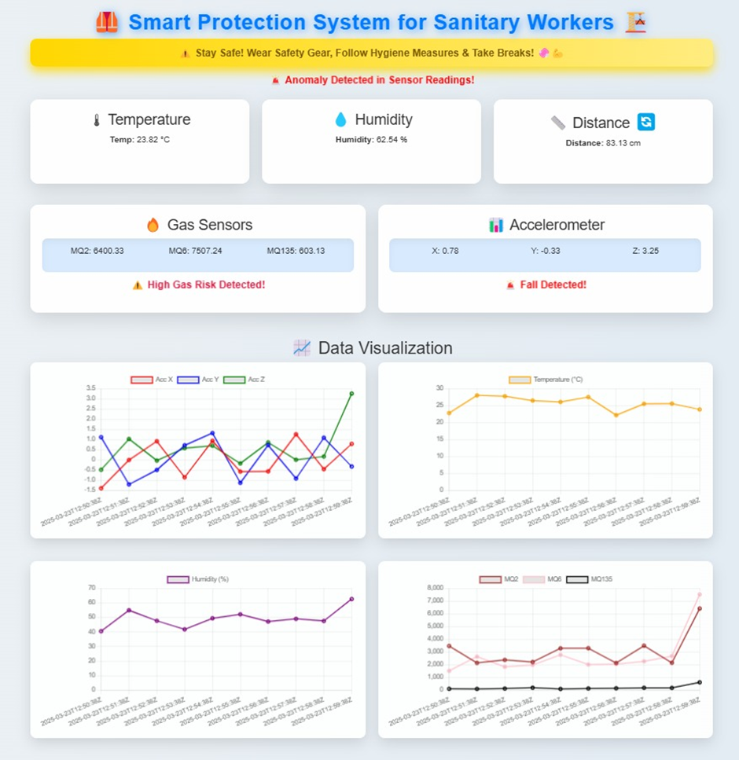
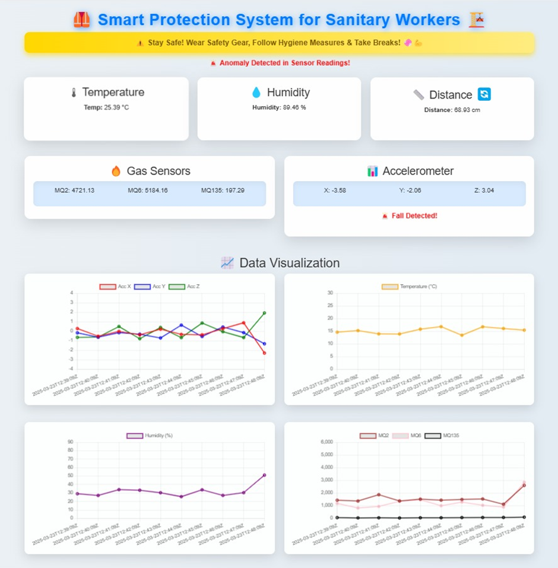
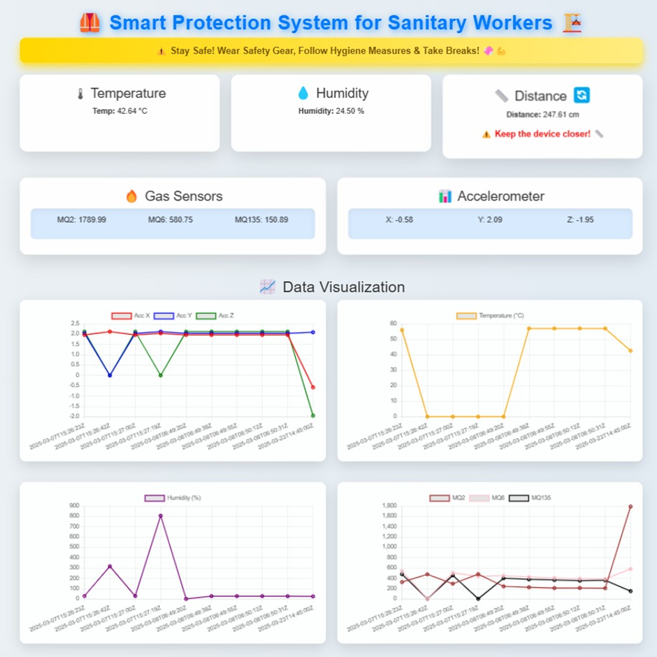
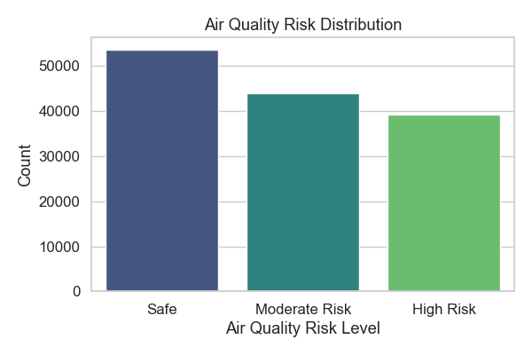
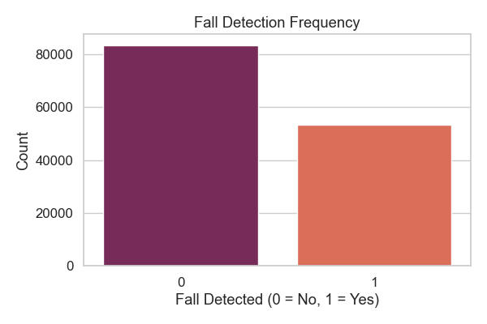
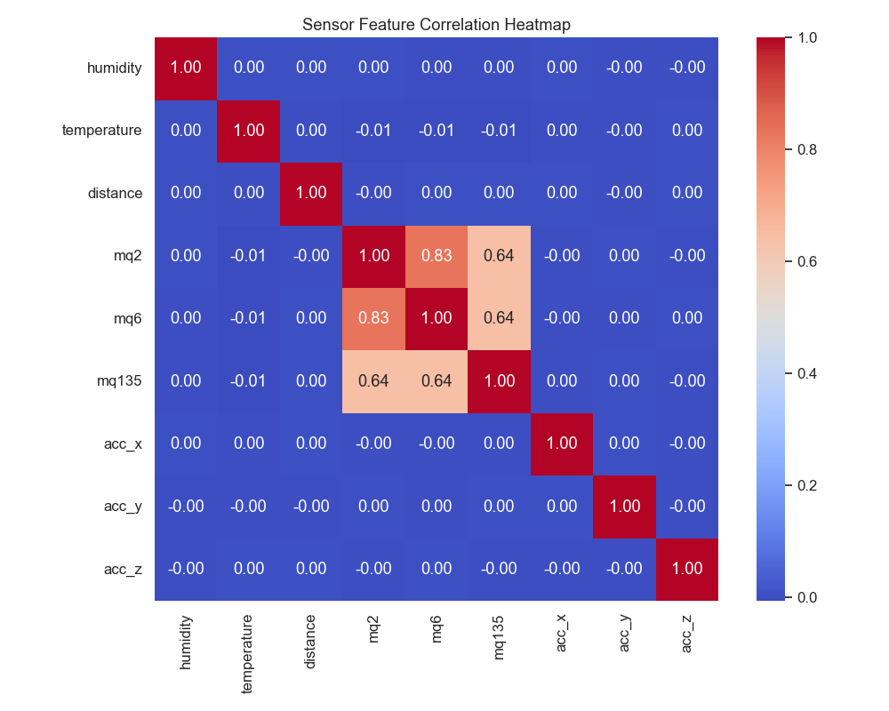
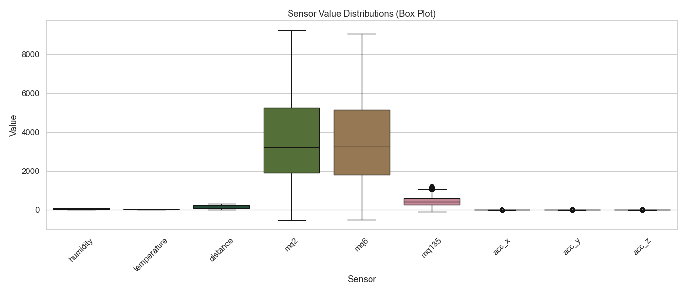
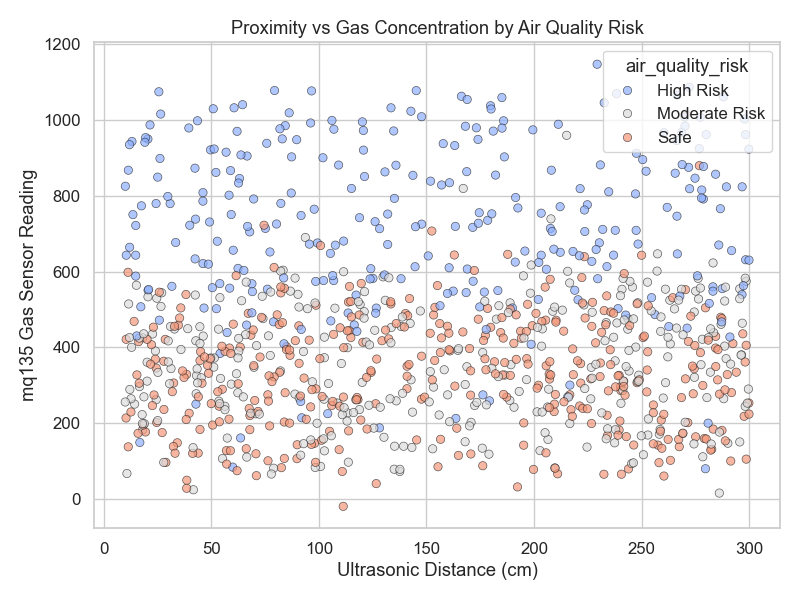

# 🛡️ TriSafe-System: AI-Powered IoT Safety Platform for Sanitation Workers

A real-time, intelligent IoT system designed to **protect sanitation workers** from hazardous environments using a combination of sensor fusion, anomaly detection, and fall/gas event classification. The system utilizes low-cost hardware and deployable machine learning models to identify critical health and environmental threats before they escalate.

---

## 📂 Repository Overview

| File Name                                 | Description                                                  |
|------------------------------------------|--------------------------------------------------------------|
| `Airqualityclassification.ipynb`         | ML notebook for classifying air quality using CatBoost/XGBoost |
| `Anomaly_detection.ipynb`                | Autoencoder-based multivariate anomaly detection             |
| `fall_detection.ipynb`                   | Fall detection using ADXL345 accelerometer data              |
| `iot_safety_dataset_136789_updated.csv`  | Synthetic dataset with sensor data simulating real-world scenarios |
| `Arduino and ESP8266 NodeMCU Code.pdf`   | Arduino Nano + ESP8266 wiring and code for live sensor readings |

---

## ⚙️ Hardware Architecture

### 🧩 Sensor-Microcontroller Wiring Diagram

The system architecture integrates multiple gas, motion, and thermal sensors with an **Arduino Nano** microcontroller, interfaced with **ESP8266** for wireless telemetry.

**Sensors Integrated:**
- 🧪 MQ2, MQ6, MQ135 (Gas detection)
- 🌡️ DHT11 (Temperature & Humidity)
- 📏 Ultrasonic Sensor (Proximity)
- 🧍‍♂️ ADXL345 (Fall detection via acceleration)

Power is stabilized using LM2596 step-down converters. The ESP8266 relays sensor values to a cloud dashboard via UART communication.

---

## 🌐 Real-Time Monitoring Dashboard

### 🔴 Anomaly + Fall + Gas Detected

### 🟠 Gas Risk + Anomaly

### ✅ Normal Conditions

Each dashboard snapshot visualizes telemetry readings along with event triggers. Alerts are raised for sensor anomalies, gas threshold breaches, and potential worker falls.

---

## 🧪 Dataset Summary

The project includes a synthetically generated dataset curated to simulate varied field scenarios faced by sanitation workers in hazardous environments. Sensor readings are mapped to:

- Gas concentrations (MQ2, MQ6, MQ135)
- Environmental vitals (Temperature, Humidity)
- Accelerometer data (X, Y, Z axes)
- Distance from ground (Ultrasonic)
- Labels: `fall_detected`, `toxic_gas_risk`, `anomaly_detected`

The dataset captures critical cases such as methane buildup, unconscious fall, and abnormal environmental changes — making it suitable for training intelligent safety models.

---

## 📊 Visual Insights from the Dataset

To support transparency and reproducibility, comprehensive visualizations are provided:

| Insight Type                      | Visualization |
|----------------------------------|----------------|
| Air Quality Risk Distribution    |  |
| Fall Detection Frequency         |      |
| Correlation Matrix               |  |
| Boxplots of Sensor Readings      |                         |
| Pairwise Feature Patterns        |                       |
| Distance vs Gas Scatter          |              |

These insights confirm meaningful associations between variables and the impact of environmental factors on safety risks.

---

## 🧠 ML Pipeline Breakdown

| Task                | Approach & Model        | Input Sensors Used |
|---------------------|--------------------------|---------------------|
| Toxic Gas Detection | CatBoost, XGBoost        | MQ2, MQ6, MQ135     |
| Fall Classification | Z-axis threshold + SVM   | ADXL345             |
| Multivariate Anomaly| AutoEncoder              | All sensor inputs   |

Each model was trained and evaluated on labeled synthetic data and is ready for deployment in embedded or edge environments.

---

## 📦 Reproducibility Assurance

The repository includes all key components needed to verify system behavior:

✅ Dataset and labeled outputs  
✅ ML notebooks with full training logic  
✅ Hardware wiring schematic  
✅ Deployed dashboard snapshots  
✅ Sensor-Arduino-ESP8266 communication code  

---

## 🖥️ GitHub Repository

> 🔗 [TriSafe-System Repository](https://github.com/Hrithik30-max/TriSafe-System)  
> Hosted for transparency, academic validation, and reproducibility — **not for plug-and-play reuse**.

---

## 💡 Future Directions

- Add LoRaWAN support for long-range deployments
- Enable real-time triage with hospital communication
- Integrate low-power solar-based wearables
- Explore transformer-based multivariate forecasting

---

> ⚠️ Note: This repository is part of a formal research contribution and not intended for commercial replication. All experimental designs and logic remain property of the research team.
